# DeeDeeOS

A custom Linux distro built for playing (and hacking on) Mario2, made at CodeDay Lucknow 2026.

## What is this?

CodeDay Lucknow 2026 had a retro theme: "ye un dino ki baat hai." We decided to lean into that fully and build a retro-themed operating system, not just a game.

The result is DEEOS, short for Doordarshan Operating System. Doordarshan is India's old state television broadcaster, and the whole distro is built around that nostalgia: a custom Doordarshan-style splash animation on boot, a desktop reskinned to look like Windows 7, and custom icons throughout. Under the hood it's based on Lubuntu, and in this repo the distro folder is still named `lubunut` from that base.

Baked into the OS is a pre-installed link on the desktop that opens straight into Mario2, a small platformer we built and kept extending. To make it feel complete, we also built a physical controller for it using an ESP32, so you can play the game with real hardware instead of a keyboard.

This repo has two halves:

- **`Game/`**, the Mario2 platformer itself
- **`lubunut/`**, our custom Linux distro (built as a VirtualBox VM), plus the custom desktop assets

## Demo

**The OS booting into its Doordarshan-style splash and Windows 7-style desktop:**

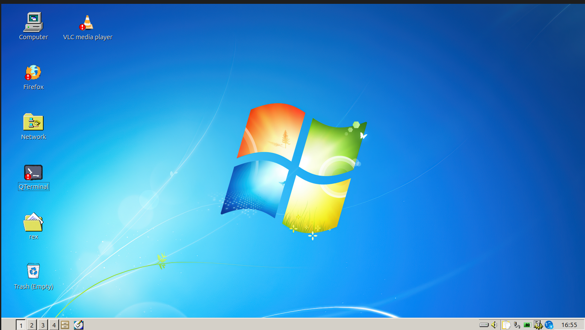

**Mario2 running inside DEEOS:**

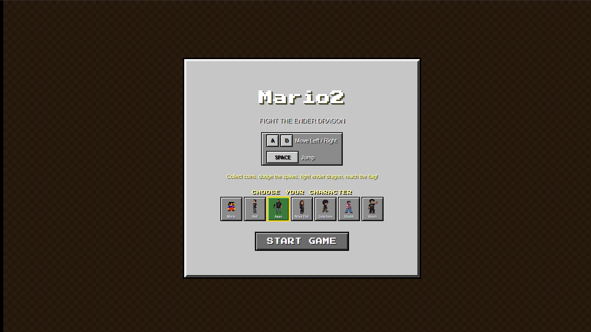

**The ESP32 controller in action:**

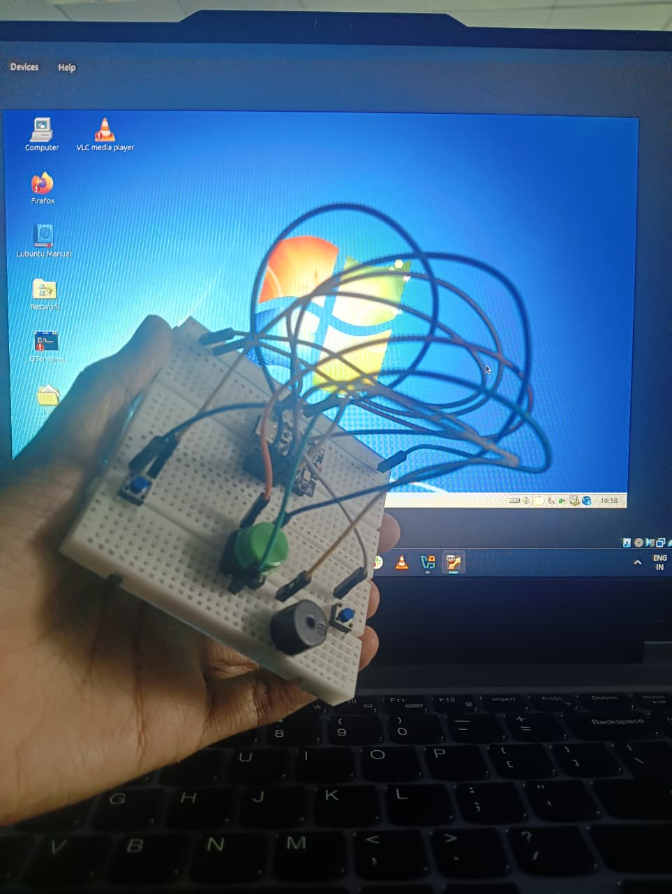

## Team

Built at CodeDay Lucknow 2026 by:

<table>
<tr>
<td align="center"><br><b>Saurabh Tiwari</b><br><a href="https://github.com/rexaintreal">@rexaintreal</a><br>built the OS and the game</td>
<td align="center">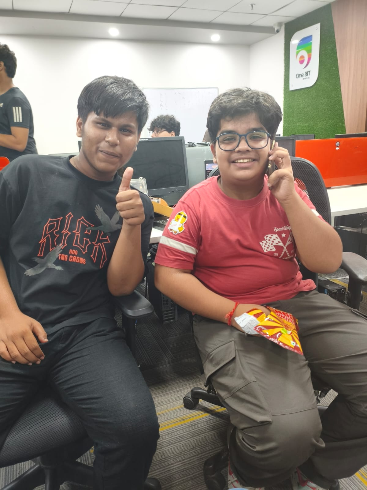<br><b>Aniruddh</b> & <b>Atharv Shukla</b><br><a href="https://github.com/Atharv-Shukla-987">@Atharv-Shukla-987</a><br>built the DIY ESP32 game controller (ages 14 and 15)</td>
<td align="center">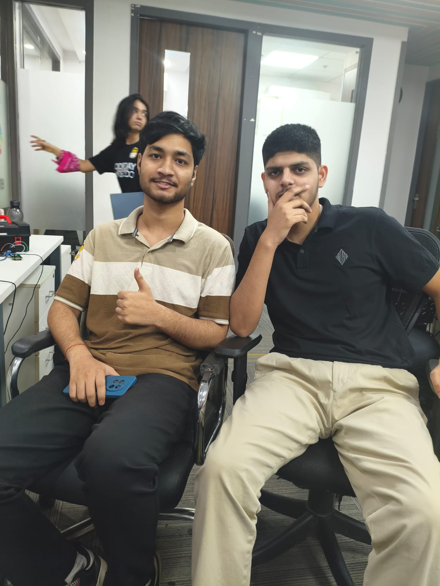<br><b>Sujal and Yuvraj</b><br>artwork and visual design</td>
</tr>
</table>

Custom icons and extra assets made with help from the CodeDay crew, thank you.

## What we built at CodeDay

- **DeeDeeOS**, a Lubuntu-based distro packaged as a VirtualBox VM (`lubunut.vbox` / `.vdi`), with a custom Doordarshan-themed splash screen and a Windows 7-style desktop for the retro feel.
- **Custom desktop icons**, replacing the default Firefox, Recycle Bin, Terminal, and VLC icons with our own designs.

  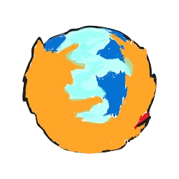 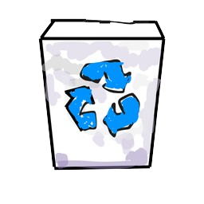 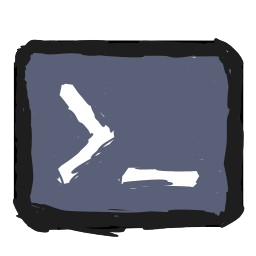 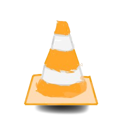

- **A pre-installed link on the desktop** that opens directly into Mario2 when you boot the OS.
- **A hardware controller**, a DIY gamepad built on an ESP32, wired up to work with the game.
- **Continued work on Mario2 itself.** The game started a few days before the event (original base at [github.com/rexaintreal/mario2](https://github.com/rexaintreal/mario2)), and we made it our own for CodeDay: the characters are modeled after members of our team, the invincibility power-up is a biryani (which was actually served at the event), the final boss is an Ender Dragon, and there are a few Minecraft easter eggs scattered through the level.

## Mario2, the game

No frameworks or libraries. Just HTML, CSS, and vanilla JavaScript, rendered with the Canvas 2D API.

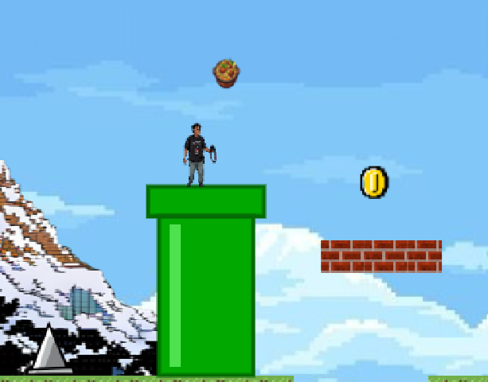 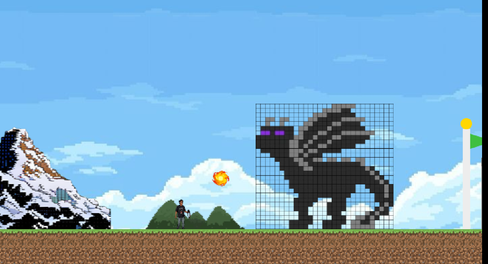

### Features

- Real sprite assets for the player, enemies, and tiles, including CodeDay team members as characters
- Sound effects and background music
- A longer level with more platforms, pipes, and pits
- A biryani power-up that gives temporary invincibility
- A sword for the final boss fight
- Particle effects for jumping, coin pickups, and attacking
- A boss fight against an Ender Dragon, with Minecraft easter eggs along the way
- Improved start, game over, and win screens, plus an in-game HUD
- Gamepad support, using the ESP32 controller we built for CodeDay

## Folder structure

```
images/               screenshots and team photos used in this README
assets/                custom distro icons (firefox, recycle bin, terminal, vlc)
Game/                  the Mario2 platformer
  assets/              player, dragon, tiles, coin, powerup images, etc.
  music/               sound effects and background music
  screenshots/         dev log screenshots
  game.js
  index.html
  style.css
lubunut/               our custom Linux distro (DEEOS)
  Logs/
  lubunut.vbox
  lubunut.vbox-prev
  lubunut.vdi
README.md
```
